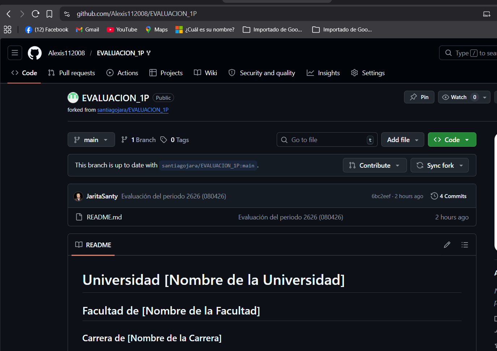
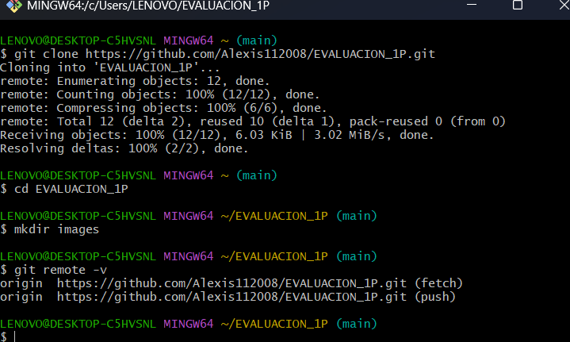
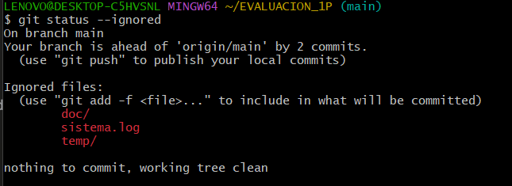
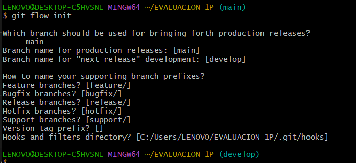
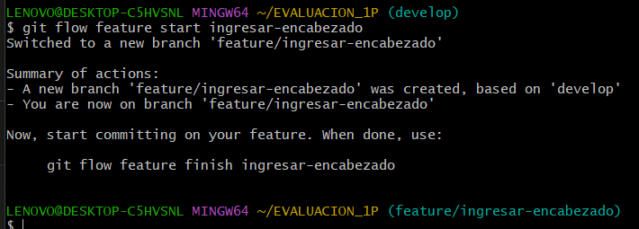
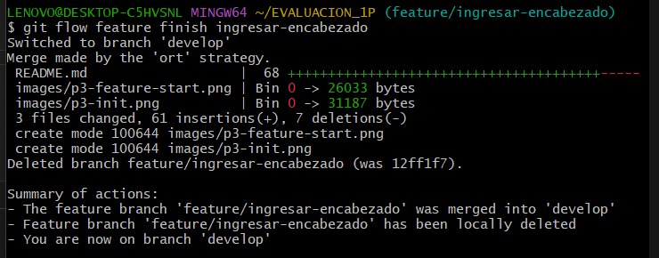

# Universidad TECNICA DE AMBATO
## Facultad de Ingeneria en Sistemas, Electronica e industrial 
### Carrera de Software 

**Asignatura:** Manejo y Configuración de Software  
**Nombre del Estudiante:** Alexis Nata 
**Fecha:** 8/4/2026

---

# Evaluación Práctica de Git y GitHub

## Instrucciones Generales

- Cada pregunta debe ser respondida directamente en este archivo **(README.md)** debajo del enunciado correspondiente. 
- Es importante que se coloque capturas de pantalla como evidencia de la parte práctica. Se recomienda crear una carpeta `images/` para almacenar las capturas de pantalla.
- Cada respuesta debe ir acompañada de uno o más **commits**, según se indique en cada pregunta.
- Cuando se indique, deberán realizarse acciones prácticas dentro del repositorio (como creación de archivos, ramas, resolución de conflictos, etc.).
- Cada pregunta debe estar **etiquetada con un tag**, únicamente en el commit final correspondiente, con el formato: `"Pregunta 1"`, `"Pregunta 2"`, etc.

---

## Pregunta 1 (1 punto)

**Explicar la diferencia entre los siguientes conceptos/comandos en Git y GitHub:**

- `git clone`  
- `fork`  
- `git pull`

### Parte práctica:

- Realizar un **fork** de este repositorio en la cuenta personal de GitHub del estudiante.
- Luego, realizar un **clone** del fork en el equipo local.
- En este README, describir el proceso seguido:
  - ¿Cómo se realizó el fork?
  - ¿Cómo se realizó el clone del fork?
  - ¿Cómo se verificó que se estaba trabajando sobre el fork y no sobre el repositorio original?
- Realizar en la rama `main` todo lo que corresponde a esta pregunta.

**📝 Respuesta:**

### Diferencias entre git clone, fork y git pull

**git clone:** Copia un repositorio remoto completo con todo su historial  
a tu máquina local. Se usa para empezar a trabajar localmente en un proyecto.

**fork:** Es una copia de un repositorio en GitHub dentro de tu propia cuenta. 
Permite trabajar de forma independiente sin afectar el repositorio original. 
Es una acción que ocurre en GitHub, no en la terminal.

**git pull:** Descarga e integra los cambios del repositorio remoto a tu 
rama local actual. Se usa cuando ya tienes el repositorio clonado y quieres 
actualizar tu copia local.

### Proceso realizado

**¿Cómo se realizó el fork?**
Se ingresó al repositorio original del profesor en GitHub y se hizo clic en 
el botón "Fork" seleccionando la cuenta personal como destino.

**¿Cómo se realizó el clone del fork?**
Se ejecutó el siguiente comando en la terminal:
`git clone https://github.com/Alexis112008/EVALUACION_1P.git`

**¿Cómo se verificó que se trabaja sobre el fork?**
Se ejecutó `git remote -v` y se comprobó que la URL apunta al repositorio 
del usuario personal y no al del profesor.

### Evidencia



---

## Pregunta 2 (1 punto)

**Configurar un archivo `.gitignore` para que ignore:**

- Todos los archivos con extensión `.log`.
- Una carpeta llamada `temp/`.
- Todos los archivos `.md` y `.txt`de la carpeta `doc/`. (Probar agregando un archivo `prueba.md` y un archivo `prueba.txt` dentro de la carpeta y fuera de la carpeta.)

### Requisitos:

1. Realizar un **primer commit** que incluya únicamente el archivo `.gitignore` con las reglas de exclusión definidas.
2. Realizar un **segundo commit** que incluya las creación de los archivos de prueba.
2. Realizar un **tercer commit** donde se explique en este README la función del archivo `.gitignore` y se muestre evidencia de que los archivos y carpetas indicadas no están siendo rastreadas por Git.

**Importante:**  
- Solo el **tercer commit** debe llevar el **tag `"Pregunta 2"`**.

**📝 Respuesta:**


### ¿Qué es el archivo .gitignore?
El archivo `.gitignore` le indica a Git qué archivos o carpetas debe ignorar
y no rastrear en el control de versiones. Es útil para excluir archivos
temporales, logs, credenciales o dependencias que no deben subirse al repositorio.

### Reglas configuradas
- `*.log` → ignora todos los archivos con extensión .log
- `temp/` → ignora toda la carpeta temp/ y su contenido
- `doc/*.md` y `doc/*.txt` → ignora archivos .md y .txt solo dentro de doc/

### Verificación
Los archivos `prueba.md` y `prueba.txt` en la raíz SÍ son rastreados por Git
(aparecen en git ls-files) porque están fuera de la carpeta `doc/`.
Los archivos dentro de `doc/`, la carpeta `temp/` y `sistema.log` NO son
rastreados, como se evidencia en el git status --ignored.

### Evidencia


---

## Pregunta 3 (2 puntos)

**Utilizar Git Flow para desarrollar una nueva funcionalidad llamada `ingresar-encabezado`.**

### Requisitos:

- Inicializar el repositorio con Git Flow, utilizando las ramas por defecto: `main` y `develop`.
- Crear una rama de tipo `feature` con el nombre `ingresar-encabezado`.
- En dicha rama, **completar con los datos personales del estudiante** el encabezado que ya se encuentra al inicio de este archivo `README.md`.
- Realizar al menos un commit durante el desarrollo.
- Finalizar el hotfix siguiendo el flujo de trabajo establecido por Git Flow.

### En la sección de respuesta, se debe incluir:

- Los **comandos exactos** utilizados desde la inicialización de Git Flow hasta el cierre de la rama.
- Una descripción del **proceso seguido**, indicando el propósito de cada paso.
- Una reflexión sobre las **ventajas de aplicar Git Flow**, especialmente en contextos colaborativos o proyectos de larga duración.

**Importante:**

- Deben realizarse varios commits durante esta pregunta.
- **Solo el commit final** debe llevar el **tag `"Pregunta 3"`**.
- El flujo debe respetar la estructura de Git Flow con las ramas `develop` y `main`.

**📝 Respuesta:**


### Comandos utilizados con Git Flow

```bash
# 1. Inicializar Git Flow
git flow init

# 2. Crear la rama feature
git flow feature start ingresar-encabezado

# 3. Commit durante el desarrollo
git add README.md
git commit -m "Pregunta 3: Completar encabezado con datos personales"

# 4. Finalizar la feature
git flow feature finish ingresar-encabezado
```

### Descripción del proceso
- `git flow init`: Inicializa el repositorio con la estructura de Git Flow,
  definiendo main como rama de producción y develop como rama de desarrollo.
- `git flow feature start ingresar-encabezado`: Crea una rama llamada
  feature/ingresar-encabezado a partir de develop para trabajar de forma aislada.
- Los cambios se realizan con commits normales dentro de la rama feature.
- `git flow feature finish ingresar-encabezado`: Fusiona la rama feature
  en develop y la elimina automáticamente.

### Ventajas de Git Flow
Git Flow organiza el trabajo en ramas bien definidas, permitiendo que varios
desarrolladores trabajen en paralelo sin interferirse. En proyectos largos
mantiene versiones estables en main mientras el desarrollo continúa en develop,
reduciendo errores en producción y facilitando el manejo de versiones.

### Evidencia




---

## Pregunta 4 (2 puntos)

**Trabajo con Issues y Pull Requests**

### Parte teórica:

- ¿Qué es un Pull Request y cuál es su función dentro de un flujo de trabajo colaborativo con Git y GitHub?
- ¿Por qué es importante revisar un Pull Request antes de fusionarlo con la rama principal?
- ¿Qué tipo de observaciones o validaciones se suelen realizar durante la revisión de un Pull Request?

### Parte práctica:

- Trabajar en la rama `develop`, ya existente desde la configuración de Git Flow.
- Realizar los cambios necesarios en este archivo `README.md` para responder las preguntas.
- Realizar un **commit** con los cambios de la primera pregunta y subirlo a la rama `develop` del repositorio remoto.
- Crear un **pull request** desde `develop` hacia `main` en GitHub, con el nombre `"Pregunta 4 - Apellido Nombre"`.
- Crear comentarios solicitando: 1. que se agregue la respuesta de la segunda pregunta y luego agregando la respuesta con el respectivo commit; y 2. el mismo procedimiento para la tercera pregunta.
- **Aprobar** el pull request para que se haga el merge respectivo hacia `main`.

### En la sección de respuesta, se debe incluir:

- Un resumen del procedimiento realizado con las respectivas preguntas y capturas.
- El número y enlace al pull request.

**📝 Respuesta:**


### ¿Qué es un Pull Request?
Un Pull Request (PR) es una solicitud para integrar los cambios de una rama
en otra dentro de GitHub. Permite que otros colaboradores revisen el código
antes de fusionarlo, facilitando la revisión y el control de calidad en equipos.

### ¿Por qué es importante revisarlo antes de fusionar?
Revisar un PR evita introducir errores o código incompleto en la rama principal.
Permite detectar bugs, mejorar la calidad del código y asegurar que los cambios
cumplen con los estándares del proyecto antes de afectar la versión estable.

### ¿Qué se valida en una revisión?
- Que el código funcione correctamente
- Que siga las convenciones de estilo del proyecto
- Que no rompa funcionalidades existentes
- Que la documentación esté actualizada
- Que los commits sean claros y descriptivos

---

## Pregunta 5 (2 puntos)

**Resolver conflictos entre ramas y realizar un Pull Request**

### Requisitos:

- Crear dos ramas llamadas `ramaA` y `ramaB`, ambas a partir de la rama `develop`.
- En `ramaA`, crear un archivo llamado `archivoA.txt` con el contenido:  
  `Contenido A`
- En `ramaB`, crear un archivo con el mismo nombre (`archivoA.txt`), pero con el contenido:  
  `Contenido B`
- Intentar fusionar `ramaB` sobre `ramaA`, lo cual debe generar un conflicto.
- Resolver el conflicto combinando ambos contenidos.
- Realizar el merge de `ramaA` hacia `develop`.
- Crear un **pull request** desde `develop` hacia `main`.
- Una vez completado lo anterior, eliminar las ramas `ramaA` y `ramaB`.

### En la sección de respuesta, se debe incluir:

- El procedimiento completo:
  - Cómo se crearon las ramas.
  - Cómo se generó y resolvió el conflicto.
  - Cómo se realizó el merge hacia `develop`.
  - Cómo se eliminaron las ramas al finalizar.
- El enlace al pull request.
- Una breve explicación de qué es un conflicto en Git y por qué ocurrió en este caso.

**📝 Respuesta:**

<!-- Escribe aquí tu respuesta completa a la Pregunta 5 -->

---

## Pregunta 6 (2 puntos)

**Realizar limpieza, explicar versionamiento semántico y enviar cambios al repositorio original**

### Requisitos:

- Trabajar en la rama `develop` del fork del repositorio.
- Eliminar los archivos `archivoA.txt` y `archivoB.txt` creados en preguntas anteriores.
- Realizar un merge desde `develop` hacia `main` en el repositorio local.
- Enviar los cambios de la rama `main` local a la rama `develop` del repositorio remoto (fork). Recuerde incluir todos los tags creados (6 tags).
- Finalmente, crear un **pull request** desde la rama `develop` del fork hacia la rama `main` del repositorio original (del cual se realizó el fork en la Pregunta 1). El titulo del pull request debe ser `"NOMBRE APELLIDOS"`, en la descripción colocar el link de su repositorio de GitHub.

### En la sección de respuesta, se debe incluir:

- Una explicación del proceso realizado paso a paso.
- Una explicación del **versionamiento semántico**, indicando:
  - En qué consiste.
  - Sus tres componentes (MAJOR, MINOR, PATCH).
- Si hace falta agregar alguna evidencia adicional, agregue un tag adicional que sea `Version Final`.

**📝 Respuesta:**

<!-- Escribe aquí tu respuesta completa a la Pregunta 6 -->
